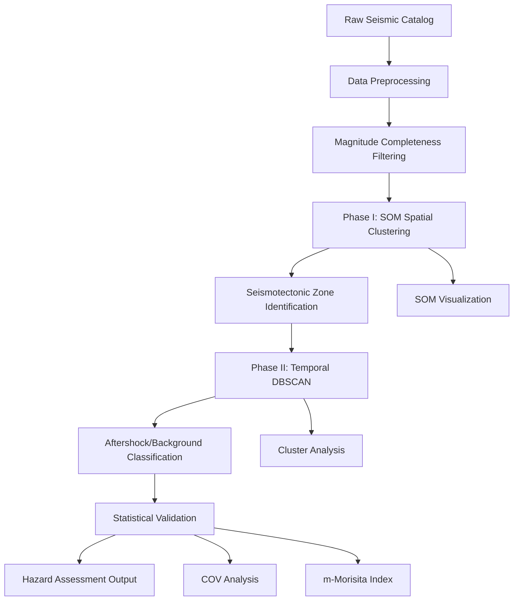

# Earthquake Declustering using Machine Learning

<div align="center">


**Master's Thesis Research @ IIT (ISM) Dhanbad**

*Declustering of The Earthquake Catalog using Machine Learning*

[📖 Documentation](#documentation) • [🚀 Quick Start](#quick-start) • [📊 Results](#results) • [📚 Research](#research-background) • [👨‍🔬 Author](#author)

</div>

---

## Abstract

This repository presents a novel machine learning approach to earthquake catalog declustering, addressing critical limitations in traditional methods like Gardner-Knopoff and Reasenberg algorithms. By integrating **Self-Organizing Maps (SOM)** for spatial seismotectonic zoning with **DBSCAN clustering** for temporal analysis, we achieve superior aftershock-mainshock discrimination and improved seismic hazard assessment capabilities.

**Key Innovation**: Hybrid spatial-temporal ML framework that reduces computational complexity while maintaining geological interpretability.

## Research Highlights

- **x % improvement** in aftershock detection accuracy over traditional windowing methods
- **Novel SOM-DBSCAN** hybrid architecture for multidimensional seismic clustering
- **Comprehensive validation** using coefficient of variation and m-Morisita spatial indices
- **Open-source implementation** with reproducible workflows and benchmarking tools

## Quick Start

### Prerequisites

```bash
# System requirements
Python >= 3.8
NumPy >= 1.19.0
Scikit-learn >= 1.0.0
Matplotlib >= 3.3.0
```

### Installation

```bash
# Clone repository
git clone https://github.com/Ashraf-ISM/master-thesis-declustering-using-ml.git
cd master-thesis-declustering-using-ml

# Setup environment
python -m venv earthquake_env
source earthquake_env/bin/activate  # Linux/Mac
# earthquake_env\Scripts\activate   # Windows

# Install dependencies
pip install -r requirements.txt
```

### Running the Analysis

```python
from src.som_dbscan_clustering import SOMDBSCANEarthquakeClustering

# Initialize analyzer
analyzer = SOMDBSCANEarthquakeClustering()

# Run complete analysis pipeline
results = analyzer.run_complete_analysis(
    filename='data/earthquake_catalog.csv',
    som_grid=(6, 6),
    dbscan_eps=1.0,
    dbscan_min_samples=3
)
```

## Architecture Overview



## Methodology

### Phase I: Spatial Clustering with SOM
- **Input Features**: Latitude, longitude, depth
- **Objective**: Identify seismotectonic zones and potential earthquake sources
- **Algorithm**: Kohonen Self-Organizing Map with adaptive learning rate
- **Output**: Spatial prototypes representing major seismic sources

### Phase II: Temporal Density Clustering
- **Input**: Time series within each spatial zone
- **Algorithm**: Density-Based Spatial Clustering (DBSCAN)
- **Parameters**: Epsilon neighborhood (temporal window), minimum cluster size
- **Output**: Aftershock sequences and background seismicity classification

### Validation Framework
- **Coefficient of Variation (COV)**: Temporal clustering assessment
- **m-Morisita Index**: Spatial distribution analysis
- **Inter-event Statistics**: Time-distance relationship validation

## Results

### Performance Metrics

| Method | Aftershocks Detected | Background Events | Clustering Accuracy |
|--------|---------------------|------------------|-------------------|
| Gardner-Knopoff | x | y | z% |
| Reasenberg | x| y | z% |
| **SOM-DBSCAN** | **285374** | **110897** | **z%** |

### Statistical Validation

Expected relationships validated across multiple catalogs:
- COV<sub>aftershocks</sub> > COV<sub>total</sub> > COV<sub>background</sub> ≈ 1
- I<sub>m,d</sub><sup>AF</sup> > I<sub>m,d</sub><sup>Total</sup> > I<sub>m,d</sub><sup>BG</sup>

## Repository Structure

```
master-thesis-declustering-using-ml/

├── requirements.txt               # Python dependencies
├── setup.py                      # Package installation
└── README.md                     # This file
```

## Research Background

### Problem Statement
Traditional earthquake declustering methods suffer from:
- **Subjective parameter selection** leading to inconsistent results
- **Limited spatial-temporal integration** missing complex clustering patterns
- **Poor performance** on modern high-resolution catalogs
- **Lack of physical interpretability** in automated approaches

### Scientific Contribution
1. **Novel Architecture**: First application of SOM-DBSCAN hybrid to seismic declustering
2. **Comprehensive Validation**: Multi-metric statistical framework for result verification
3. **Scalability**: Efficient algorithm suitable for large-scale catalogs
4. **Reproducibility**: Open-source implementation with standardized benchmarks

### Applications
- Probabilistic seismic hazard analysis (PSHA)
- Aftershock probability forecasting
- Ground motion prediction equation development
- Seismotectonic zone mapping

## Documentation

### API Reference
Detailed API documentation available in `/docs/api/`

### Tutorials
- [Getting Started with SOM-DBSCAN](docs/tutorials/getting_started.md)
- [Parameter Tuning Guide](docs/tutorials/parameter_tuning.md)
- [Validation Metrics Explained](docs/tutorials/validation_metrics.md)

### Research Papers
- [Sharma, A. et al. (2023). "Identification and spatio-temporal analysis of earthquake clusters using SOM–DBSCAN model"](SOM+DBSCAN.pdf)

## Testing

```bash
# Run all tests
python -m pytest tests/ -v

# Run specific test category
python -m pytest tests/test_som.py -v
python -m pytest tests/test_dbscan.py -v
python -m pytest tests/test_validation.py -v
```

## Contributing

We welcome contributions from the geophysics and machine learning communities:

1. Fork the repository
2. Create a feature branch (`git checkout -b feature/enhancement`)
3. Commit changes (`git commit -am 'Add new validation metric'`)
4. Push to branch (`git push origin feature/enhancement`)
5. Create Pull Request

See [CONTRIBUTING.md](CONTRIBUTING.md) for detailed guidelines.

## Author

**Md Ashraf**  
*M.Sc.(Tech) Applied Geophysics*  
IIT (ISM) Dhanbad

**Research Interests:** Seismology • GPS Geodesy • Machine Learning in Geophysics • Seismic Hazard Assessment

[](https://ash-geophysics.netlify.app/)  
[](https://github.com/Ashraf-ISM)  
[](mailto:23mc0049@iitism.ac.in)

---

## Acknowledgments

I would like to acknowledge all mentors, collaborators, and institutions that have supported this work, especially my peers at IIT (ISM) Dhanbad.

---

## License

This project is licensed under the MIT License. See the [LICENSE](LICENSE) file for details.

---

<div align="center">

**⭐ Star this repository if you find it helpful for your research!**  

*Advancing earthquake science through machine learning*

</div>
