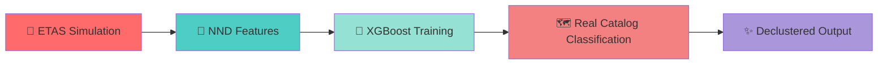

<div align="center">

# 🌍 Earthquake Declustering with Machine Learning

### *Separating Mainshocks from Aftershocks Using Physics-Informed AI*

[](https://www.python.org/)
[](https://xgboost.ai/)
[](https://scikit-learn.org/)
[](https://github.com)


---

**[🎯 Overview](#-the-big-picture) • [🔬 Methodology](#-methodology) • [📊 Results](#-results) • [🚀 Quick Start](#-quick-start) • [🤝 Contribute](#-contributing)**

</div>

---

## 🎯 The Big Picture

<table>
<tr>
<td width="50%">

### The Challenge

Earthquake catalogs are messy. They contain:
- 🟢 **Independent mainshocks** (background seismicity)
- 🔴 **Dependent aftershocks** (triggered events)

**Why it matters:**
- Mixing them up → Bad hazard maps
- Aftershocks skew statistical analyses
- Building codes need clean data

</td>
<td width="50%">

### Our Solution

**Adaptive ML framework** that learns from physics:

```diff
- Fixed time-distance windows
- Manual parameter tuning
- Regional recalibration needed

+ Threshold-free classification
+ Physics-informed features
+ Transfer across regions
```

</td>
</tr>
</table>

<div align="center">

### 💡 **Key Innovation: From Rules to Learning**

Traditional methods use **fixed empirical thresholds** → We use **adaptive ML trained on synthetic physics-based catalogs**

</div>

---

## 🔬 Methodology

<div align="center">



</div>

### 🎲 **Stage 1: ETAS Synthetic Catalog Generation**

<details>
<summary><b>📖 What is ETAS?</b></summary>

<br>

The **Epidemic-Type Aftershock Sequence** model treats earthquakes as a branching process:

```python
λ(t, x, y) = μ · background_rate + Σ triggered_by_previous_events
```

**7 Physical Parameters Control Everything:**

| Parameter | Symbol | NZ Value | Controls |
|-----------|--------|----------|----------|
| 🌊 Background Rate | μ | 0.477 | Spontaneous events/day |
| ⚡ Productivity | K | 4.918 | Aftershocks per mainshock |
| 📏 Mag Scaling | α | 1.233 | Bigger = more aftershocks |
| ⏱️ Temporal Decay | p | 1.005 | How fast activity drops |
| 📍 Spatial Scale | D | 0.002 | Typical aftershock distance |
| 🎯 Spatial Decay | q | 1.612 | Distance falloff rate |
| 🔗 Mag-Space Link | γ | 0.448 | Rupture size scaling |

**Output:** Synthetic catalog with ground-truth labels for training

</details>

---

### 📐 **Stage 2: Nearest-Neighbor Distance (NND) Features**

<div align="center">

#### 🧮 **The Magic Formula**

```
η = T × R

where:
  T = t_ij × 10^(-b·m/2)      [Rescaled Time]
  R = r_ij^df × 10^(-b·m/2)   [Rescaled Distance]
```

<table>
<tr>
<th>Close η → Aftershock</th>
<th>Distant η → Independent</th>
</tr>
<tr>
<td align="center">🔴 Space-time clustering</td>
<td align="center">🟢 Isolated events</td>
</tr>
</table>

</div>

**Five Features Extracted:**

<table>
<tr>
<td align="center">

**⏱️ Rescaled Time (T)**
<br>
<sub>Temporal trigger likelihood</sub>

</td>
<td align="center">

**📍 Rescaled Distance (R)**
<br>
<sub>Spatial coupling strength</sub>

</td>
<td align="center">

**📊 Magnitude Δ (Δm)**
<br>
<sub>Energy hierarchy</sub>

</td>
</tr>
<tr>
<td align="center">

**🎯 NND Metric (η)**
<br>
<sub>Composite space-time</sub>

</td>
<td align="center">

**🔗 Parent Index**
<br>
<sub>Event linkage</sub>

</td>
<td align="center">

**💎 Most Powerful**
<br>
<sub>η = 35.2% importance</sub>

</td>
</tr>
</table>

---

### 🤖 **Stage 3: XGBoost Classification**

<div align="center">

<table>
<tr>
<th>🏆 Model</th>
<th>Accuracy</th>
<th>Precision</th>
<th>Recall</th>
<th>F1-Score</th>
</tr>
<tr style="background-color: #d4edda;">
<td><b>XGBoost</b> 🥇</td>
<td><b>97.44%</b></td>
<td><b>97.66%</b></td>
<td><b>98.74%</b></td>
<td><b>98.20%</b></td>
</tr>
<tr>
<td>Gradient Boosting 🥈</td>
<td>97.11%</td>
<td>97.06%</td>
<td>98.89%</td>
<td>97.97%</td>
</tr>
<tr>
<td>Random Forest 🥉</td>
<td>96.72%</td>
<td>96.22%</td>
<td>95.15%</td>
<td>97.91%</td>
</tr>
<tr>
<td>SVM</td>
<td>94.36%</td>
<td>94.48%</td>
<td>94.36%</td>
<td>94.40%</td>
</tr>
</table>

#### 🎯 **Confusion Matrix Highlights**

<table>
<tr>
<td></td>
<th>Predicted Background</th>
<th>Predicted Triggered</th>
</tr>
<tr>
<th>Actual Background</th>
<td align="center" style="background-color: #d4edda;"><b>94.4%</b> ✅</td>
<td align="center" style="background-color: #f8d7da;">5.6%</td>
</tr>
<tr>
<th>Actual Triggered</th>
<td align="center" style="background-color: #f8d7da;">1.3%</td>
<td align="center" style="background-color: #d4edda;"><b>98.7%</b> ✅</td>
</tr>
</table>

**🎊 98.7% of aftershocks correctly detected!**

</div>

---

## 🗺️ Case Study: New Zealand

<div align="center">

### 📍 **Pacific-Australian Plate Boundary**

<table>
<tr>
<td align="center">

**📅 Duration**
<br>
44 years
<br>
<sub>(1980–2024)</sub>

</td>
<td align="center">

**🌐 Events**
<br>
396,267
<br>
<sub>earthquakes</sub>

</td>
<td align="center">

**📏 Magnitude**
<br>
Mw ≥ 2.2
<br>
<sub>completeness</sub>

</td>
<td align="center">

**🧮 Fractal Dim**
<br>
df ≈ 1.568
<br>
<sub>spatial dist</sub>

</td>
</tr>
</table>

</div>

### 🏔️ **Tectonic Setting**

<table>
<tr>
<td width="50%">

#### Alpine Fault (South Island)

```
🎯 Type: Strike-slip boundary
⚡ Motion: ~30 mm/year
📈 Major quakes: M7+ every ~300 years
🗺️ Length: 600 km
```

</td>
<td width="50%">

#### Hikurangi Subduction Zone (North)

```
🎯 Type: Pacific subducting beneath Australian
⚡ Motion: Megathrust potential
📈 Activity: Dense seismicity + slow slip
🌊 Hazard: Tsunami-capable
```

</td>
</tr>
</table>

---

## 📊 Results

<div align="center">

### 🎉 **Declustering Success**

<table>
<tr>
<td align="center" width="33%">

### 🟢 Background
**230,758 events**
<br>
<h1>58.23%</h1>
<sub>Independent mainshocks</sub>

</td>
<td align="center" width="33%">

### 🔴 Triggered
**165,509 events**
<br>
<h1>41.75%</h1>
<sub>Aftershock sequences</sub>

</td>
<td align="center" width="33%">

### 🎯 Accuracy
**XGBoost Model**
<br>
<h1>97.44%</h1>
<sub>Classification performance</sub>

</td>
</tr>
</table>

---

### 📍 **Spatial Patterns Revealed**

</div>

<table>
<tr>
<td width="50%">

#### 🟢 **Background Events**

✅ Concentrated along **Alpine Fault**
<br>
✅ Distributed across **Hikurangi Subduction**
<br>
✅ Follow tectonic plate boundaries
<br>
✅ Uniform temporal distribution

**Interpretation:** These are the "normal" earthquakes driven by tectonic stress accumulation

</td>
<td width="50%">

#### 🔴 **Triggered Events**

💥 Dense clusters near **Canterbury** (2010-2011)
<br>
⚡ Major concentration at **Kaikōura** (2016)
<br>
🎯 Clear aftershock zones identified
<br>
⏱️ Temporal decay patterns observed

**Interpretation:** These are stress-transfer driven events following major mainshocks

</td>
</tr>
</table>

<div align="center">

---

### ⚡ **Major Earthquake Sequences Detected**

<table>
<tr>
<th>Event</th>
<th>Year</th>
<th>Magnitude</th>
<th>Aftershocks Detected</th>
</tr>
<tr>
<td>🌋 Canterbury (Darfield)</td>
<td>2010</td>
<td>Mw 7.1</td>
<td>~10,000+</td>
</tr>
<tr>
<td>💔 Christchurch</td>
<td>2011</td>
<td>Mw 6.3</td>
<td>(Part of Canterbury sequence)</td>
</tr>
<tr>
<td>🌊 Cook Strait/Seddon</td>
<td>2013</td>
<td>Mw 6.5</td>
<td>~2,500</td>
</tr>
<tr>
<td>⚡ Kaikōura</td>
<td>2016</td>
<td>Mw 7.8</td>
<td>~15,000+ (ongoing)</td>
</tr>
</table>

</div>

---

## 🚀 Quick Start

### ⚙️ **Installation**

```bash
# Clone the repository
git clone https://github.com/yourusername/earthquake-declustering.git
cd earthquake-declustering

# Install dependencies
pip install -r requirements.txt
```

### 💻 **Basic Usage**

<details>
<summary><b>🎲 Generate ETAS Synthetic Catalog</b></summary>

```python
from etas_model import ETASSimulator

# Initialize with New Zealand parameters
simulator = ETASSimulator(
    mu=0.4766,      # Background rate
    k=4.9184,       # Productivity
    alpha=1.2334,   # Magnitude scaling
    p=1.0051,       # Temporal decay
    d=0.0022,       # Spatial scale
    q=1.6122,       # Spatial decay
    gamma=0.4476    # Mag-spatial link
)

# Generate 10 years of synthetic seismicity
synthetic_catalog = simulator.simulate(
    duration=365*10,
    magnitude_threshold=2.2
)
```

</details>

<details>
<summary><b>📐 Extract NND Features</b></summary>

```python
from nnd_analysis import NNDFeatureExtractor

# Initialize with catalog parameters
extractor = NNDFeatureExtractor(
    b_value=1.0,        # Gutenberg-Richter
    fractal_dim=1.568   # Spatial dimension
)

# Extract features
features = extractor.extract_features(synthetic_catalog)
# Returns: DataFrame with [T, R, Δm, η, parent_index]
```

</details>

<details>
<summary><b>🤖 Train XGBoost Classifier</b></summary>

```python
from xgboost import XGBClassifier
from sklearn.model_selection import train_test_split

# Prepare data
X = features[['T', 'R', 'dm', 'eta', 'parent_idx']]
y = synthetic_catalog['label']  # 0: background, 1: triggered

# Split
X_train, X_test, y_train, y_test = train_test_split(
    X, y, test_size=0.2, random_state=42
)

# Train
model = XGBClassifier(
    max_depth=6,
    learning_rate=0.1,
    n_estimators=200
)
model.fit(X_train, y_train)

# Evaluate
print(f"Accuracy: {model.score(X_test, y_test):.4f}")
```

</details>

<details>
<summary><b>🗺️ Apply to Real Catalog</b></summary>

```python
import pandas as pd

# Load your earthquake catalog
catalog = pd.read_csv('earthquake_catalog.csv')

# Extract features
real_features = extractor.extract_features(catalog)

# Classify
predictions = model.predict(real_features)
probabilities = model.predict_proba(real_features)

# Add to catalog
catalog['event_type'] = predictions  # 0: background, 1: triggered
catalog['aftershock_probability'] = probabilities[:, 1]

# Export declustered catalog
background = catalog[catalog['event_type'] == 0]
background.to_csv('declustered_mainshocks.csv', index=False)
```

</details>

---

## 🎓 Why This Approach Works

<div align="center">

### 🆚 **Comparison with Traditional Methods**

<table>
<tr>
<th>Aspect</th>
<th>Gardner-Knopoff / Reasenberg</th>
<th>🚀 ML-Based (Ours)</th>
</tr>
<tr>
<td><b>Threshold</b></td>
<td>❌ Fixed time-distance windows</td>
<td>✅ Learned from data</td>
</tr>
<tr>
<td><b>Adaptability</b></td>
<td>❌ Needs regional tuning</td>
<td>✅ Transfers across regions</td>
</tr>
<tr>
<td><b>Complex Patterns</b></td>
<td>⚠️ Misses overlapping sequences</td>
<td>✅ Captures nuanced interactions</td>
</tr>
<tr>
<td><b>Uncertainty</b></td>
<td>❌ Binary decision only</td>
<td>✅ Probability estimates</td>
</tr>
<tr>
<td><b>Physical Basis</b></td>
<td>✅ Window-based heuristics</td>
<td>✅ Physics-informed features</td>
</tr>
</table>

</div>

---

## 🌐 Regional Transferability

<div align="center">

### 🗺️ **Testing Across Tectonic Regimes**

<table>
<tr>
<th>Region</th>
<th>Status</th>
<th>Events</th>
<th>Tectonic Setting</th>
</tr>
<tr style="background-color: #d4edda;">
<td>🇳🇿 <b>New Zealand</b></td>
<td>✅ Complete</td>
<td>396,267</td>
<td>Subduction + Strike-slip</td>
</tr>
<tr style="background-color: #fff3cd;">
<td>🇺🇸 <b>Southern California</b></td>
<td>🔄 In Progress</td>
<td>~500,000</td>
<td>Strike-slip (San Andreas)</td>
</tr>
<tr style="background-color: #f8d7da;">
<td>🇯🇵 <b>Japan</b></td>
<td>⏳ Planned</td>
<td>~1M+</td>
<td>Subduction (Pacific Ring)</td>
</tr>
<tr style="background-color: #f8d7da;">
<td>🇮🇹 <b>Italy</b></td>
<td>⏳ Planned</td>
<td>~200,000</td>
<td>Extensional tectonics</td>
</tr>
</table>

**Hypothesis:** NND features encode fundamental earthquake physics → should transfer globally

</div>

---

## 🤝 Contributing

<div align="center">

### 🌟 **We Welcome Contributions!**

<table>
<tr>
<td align="center">

🌍
<br>
**Regional Testing**
<br>
<sub>Apply to new catalogs</sub>

</td>
<td align="center">

🧮
<br>
**Feature Engineering**
<br>
<sub>Propose new physics features</sub>

</td>
<td align="center">

🤖
<br>
**Model Development**
<br>
<sub>Test new architectures</sub>

</td>
<td align="center">

📊
<br>
**Visualization**
<br>
<sub>Improve result presentation</sub>

</td>
</tr>
</table>

</div>

### 🛠️ **Development Setup**

```bash
# Fork and clone
git clone https://github.com/yourusername/earthquake-declustering.git
cd earthquake-declustering

# Create environment
python -m venv venv
source venv/bin/activate  # Windows: venv\Scripts\activate

# Install dev dependencies
pip install -r requirements-dev.txt

# Run tests
pytest tests/
```

---

## 📚 Key References

<details>
<summary><b>📖 Foundational Papers</b></summary>

<br>

1. **Aden-Antoniów et al. (2022)** - *An adaptable random forest model for the declustering of earthquake catalogs*. JGR: Solid Earth.

2. **Zaliapin & Ben-Zion (2013)** - *Earthquake clusters in southern California*. JGR: Solid Earth.

3. **Ogata (1988)** - *Statistical models for earthquake occurrences and residual analysis*. JASA.

4. **Seal et al. (2025)** - *Statistical analysis on background seismicity using NND and network analysis*. Journal of Seismology.

5. **Shcherbakov & Kothari (2025)** - *Earthquake declustering using supervised machine learning*. BSSA.

</details>

---

## 📧 Contact

<div align="center">

**Md Ashraf**
<br>
*M.Sc. (Tech.) Applied Geophysics*
<br>
*Indian Institute of Technology (ISM) Dhanbad*

<br>

[](mailto:23mc0049@iitism.ac.in)
[](https://github.com/yourusername)
[](https://linkedin.com/in/md-ashraf)

</div>

---

<div align="center">

### 🌟 **Star this repository if you find it useful!**


**Made with ❤️ for safer earthquake science**

[⬆️ Back to Top](#-earthquake-declustering-with-machine-learning)

</div>
