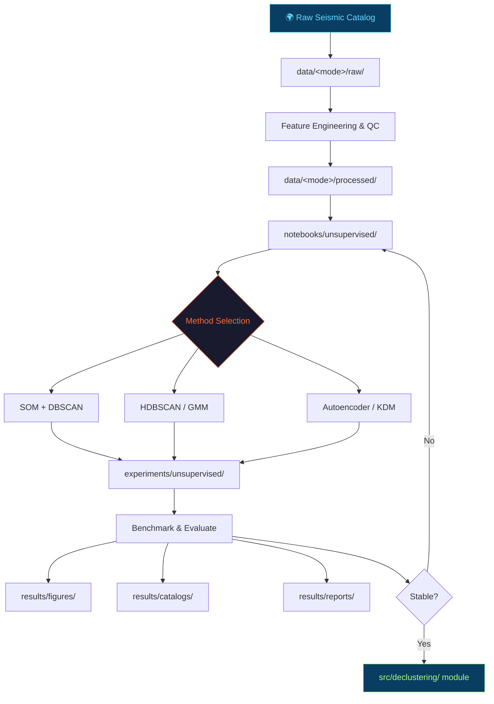

<div align="center">

<!-- Animated banner -->


<!-- Typing SVG -->
<a href="https://git.io/typing-svg">
  
</a>

<br/>

<!-- Tech Badges -->


</div>

---

<!-- Animated seismic wave divider -->
<div align="center">
<svg xmlns="http://www.w3.org/2000/svg" viewBox="0 0 900 60" width="100%">
  <defs>
    <linearGradient id="waveGrad" x1="0%" y1="0%" x2="100%" y2="0%">
      <stop offset="0%" style="stop-color:#0a0f1e;stop-opacity:0"/>
      <stop offset="20%" style="stop-color:#64d9ff;stop-opacity:0.8"/>
      <stop offset="50%" style="stop-color:#ff6b35;stop-opacity:1"/>
      <stop offset="80%" style="stop-color:#64d9ff;stop-opacity:0.8"/>
      <stop offset="100%" style="stop-color:#0a0f1e;stop-opacity:0"/>
    </linearGradient>
    <style>
      .seismic-line {
        fill: none;
        stroke: url(#waveGrad);
        stroke-width: 2;
        stroke-dasharray: 1200;
        stroke-dashoffset: 1200;
        animation: drawWave 2.5s ease forwards;
      }
      @keyframes drawWave {
        to { stroke-dashoffset: 0; }
      }
    </style>
  </defs>
  <path class="seismic-line"
    d="M0,30 L80,30 L95,30 L100,15 L110,45 L120,8 L135,52 L145,20 L155,40 L165,30 L180,30
       L210,30 L215,30 L220,18 L228,42 L236,10 L244,50 L252,25 L258,35 L265,30 L290,30
       L340,30 L345,22 L352,38 L358,15 L368,45 L375,28 L382,32 L390,30 L430,30
       L470,30 L475,20 L482,40 L490,12 L500,48 L510,22 L518,38 L525,30 L570,30
       L610,30 L615,25 L622,35 L628,18 L638,42 L646,28 L652,32 L660,30 L700,30
       L760,30 L765,15 L773,45 L781,8 L791,52 L799,20 L807,40 L815,30 L840,30 L900,30"/>
</svg>
</div>

## 🌍 Overview

> **Research Focus:** Automatic declustering of seismic catalogs to separate **mainshock sequences** from **aftershock/foreshock clusters** using a hybrid pipeline of unsupervised machine learning and classical statistical techniques — with supervised classification on the roadmap.

This repository is the canonical thesis workspace. Work is organized by **workflow stage** and **learning paradigm** (`supervised` ↔ `unsupervised`), enabling clean separation between exploratory analysis, repeatable experiments, and production-grade modules.

---

## 🗂 Repository Structure

```text
📦 earthquake-declustering-thesis/
│
├── 📁 data/
│   ├── 🔵 supervised/
│   │   ├── raw/              ← Original catalogs (untouched)
│   │   └── processed/        ← Feature-engineered datasets
│   └── 🟠 unsupervised/
│       ├── raw/              ← SOM + DBSCAN source catalogs
│       └── processed/        ← GMT-ready & model-ready datasets
│
├── 📓 notebooks/
│   ├── 🔵 supervised/        ← (Planned) labeled-data exploration
│   └── 🟠 unsupervised/      ← EDA, fractal-dim, SOM+DBSCAN
│
├── 🧪 experiments/
│   ├── 🔵 supervised/        ← (Planned) classifier benchmarks
│   └── 🟠 unsupervised/      ← DBSCAN, HDBSCAN, GMM, AE, KDM
│
├── 📊 results/
│   ├── figures/              ← GMT maps, cluster plots
│   ├── tables/               ← Metric comparison tables
│   ├── reports/              ← Generated summaries
│   └── catalogs/             ← Declustered output catalogs
│
├── 🛠 scripts/
│   └── gmt/                  ← Shell scripts for GMT figure generation
│
├── 📚 docs/
│   ├── methodology/          ← Method notes & derivations
│   └── papers/               ← Reference literature
│
└── 📦 declustering-earthquake-catalog/
    ├── scripts/              ← CLI entry points
    └── src/declustering/     ← Reusable, importable Python modules
```

---

## ⚡ Current Contents

<details>
<summary><b>🟠 Unsupervised Pipeline — Click to expand</b></summary>

<br>

| Layer | Location | Contents |
|:------|:---------|:---------|
| **Data** | `data/unsupervised/` | Processed SOM + DBSCAN datasets; GMT-formatted catalogs |
| **Notebooks** | `notebooks/unsupervised/` | Exploratory analysis · Fractal dimension · SOM+DBSCAN workflows |
| **Experiments** | `experiments/unsupervised/` | DBSCAN · HDBSCAN · GMM · Autoencoder · KDM benchmarks |
| **Figures** | `results/figures/unsupervised/` | GMT maps · cluster visualizations · comparative plots |
| **Reports** | `results/reports/unsupervised/` | Auto-generated method summaries |
| **Catalogs** | `results/catalogs/unsupervised/` | Declustered output catalogs per method |

</details>

<details>
<summary><b>🔵 Supervised Pipeline — Click to expand</b></summary>

<br>

> 🚧 **Directories are scaffolded and ready.** Supervised learning material (labeled catalog preparation, classifier training, evaluation) will populate these paths in the next thesis phase.

| Layer | Location | Status |
|:------|:---------|:-------|
| **Data** | `data/supervised/` | 📂 Awaiting labeled catalog |
| **Notebooks** | `notebooks/supervised/` | 📂 Prepared |
| **Experiments** | `experiments/supervised/` | 📂 Prepared |

</details>

<details>
<summary><b>📦 Reusable Code Layer — Click to expand</b></summary>

<br>

`declustering-earthquake-catalog/` is the **production code layer** — stable, tested logic promoted from notebooks lives here as importable Python modules and CLI scripts.

```
declustering-earthquake-catalog/
├── scripts/           ← CLI entry points (run from terminal)
└── src/declustering/ ← Core Python modules (import in notebooks)
```

</details>

---

## 🔬 Methods at a Glance

<div align="center">

| Method | Type | Role |
|:------:|:----:|:-----|
| **SOM** | Unsupervised · Neural | Self-Organizing Map for high-dim seismic feature clustering |
| **DBSCAN** | Unsupervised · Density | Spatiotemporal cluster detection; noise = mainshocks |
| **HDBSCAN** | Unsupervised · Hierarchical | Robust variant for variable-density seismicity |
| **GMM** | Unsupervised · Probabilistic | Soft cluster membership with covariance modeling |
| **Autoencoder** | Unsupervised · Deep | Latent-space anomaly detection for aftershock isolation |
| **KDM** | Statistical | Kernel Density Method — classical baseline |
| **Fractal Dim.** | Analysis | *b*-value & fractal scaling characterization |
| **GMT** | Visualization | Publication-grade seismicity maps |

</div>

---

## 🛠 Environment Setup

```bash
# 1 — Clone the repository
git clone https://github.com/<your-handle>/earthquake-declustering-thesis.git
cd earthquake-declustering-thesis

# 2 — Create and activate virtual environment
python -m venv .venv
source .venv/bin/activate          # Linux / macOS
# .venv\Scripts\activate           # Windows

# 3 — Install dependencies
pip install -r requirements.txt

# 4 — (Optional) Launch Jupyter
jupyter lab
```

---

## 📋 Working Convention

Follow this rule-of-thumb when adding new material:

```
1. 📥  Raw catalogs          →  data/<mode>/raw/
2. 🔧  Processed datasets    →  data/<mode>/processed/
3. 📓  Interactive analysis  →  notebooks/<mode>/
4. 🧪  Comparison studies    →  experiments/<mode>/
5. 📊  Generated outputs     →  results/.../<mode>/
6. 📦  Stable logic          →  declustering-earthquake-catalog/src/declustering/
```

> **Key principle:** *Notebooks explore → Experiments compare → Source modules deliver.*

---

## 🗺 Workflow Diagram


```mermaid
flowchart TD
    A[🌍 Raw Seismic Catalog] --> B[data/&lt;mode&gt;/raw/]
    B --> C[Feature Engineering & QC]
    C --> D[data/&lt;mode&gt;/processed/]

    D --> E[notebooks/unsupervised/]
    E --> F{Method Selection}

    F --> G[SOM + DBSCAN]
    F --> H[HDBSCAN / GMM]
    F --> I[Autoencoder / KDM]

    G & H & I --> J[experiments/unsupervised/]
    J --> K[Benchmark & Evaluate]

    K --> L[results/figures/]
    K --> M[results/catalogs/]
    K --> N[results/reports/]

    K --> O{Stable?}
    O -- Yes --> P[src/declustering/ module]
    O -- No  --> E

    style A fill:#0a3d62,color:#64d9ff,stroke:#64d9ff
    style P fill:#0a3d62,color:#a8ff78,stroke:#a8ff78
    style F fill:#1a1a2e,color:#ff6b35,stroke:#ff6b35
```

---

## 📝 Notes

- 🟠 **Current focus is unsupervised.** The `supervised/` directories are scaffolded and ready for the next thesis phase.
- 🗺 **GMT figures** are saved to `results/figures/unsupervised/gmt/`; the generation script lives at `scripts/gmt/`.
- 🔁 **Promote, don't duplicate.** Once notebook logic is validated, migrate it to `src/declustering/` to keep analysis reproducible.

---

<!-- Footer wave -->
<div align="center">


<sub>Built with 🌊 seismic curiosity · Thesis Workspace · All rights reserved</sub>

</div>
